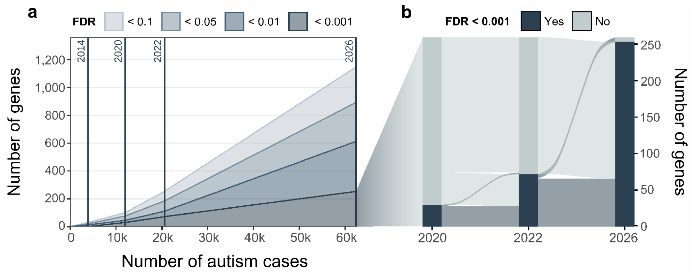
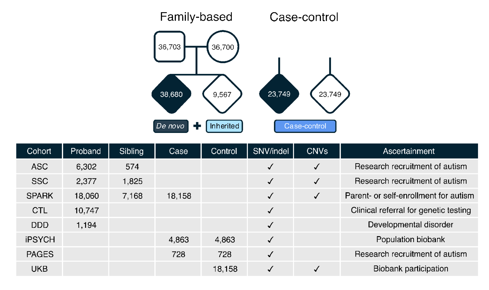
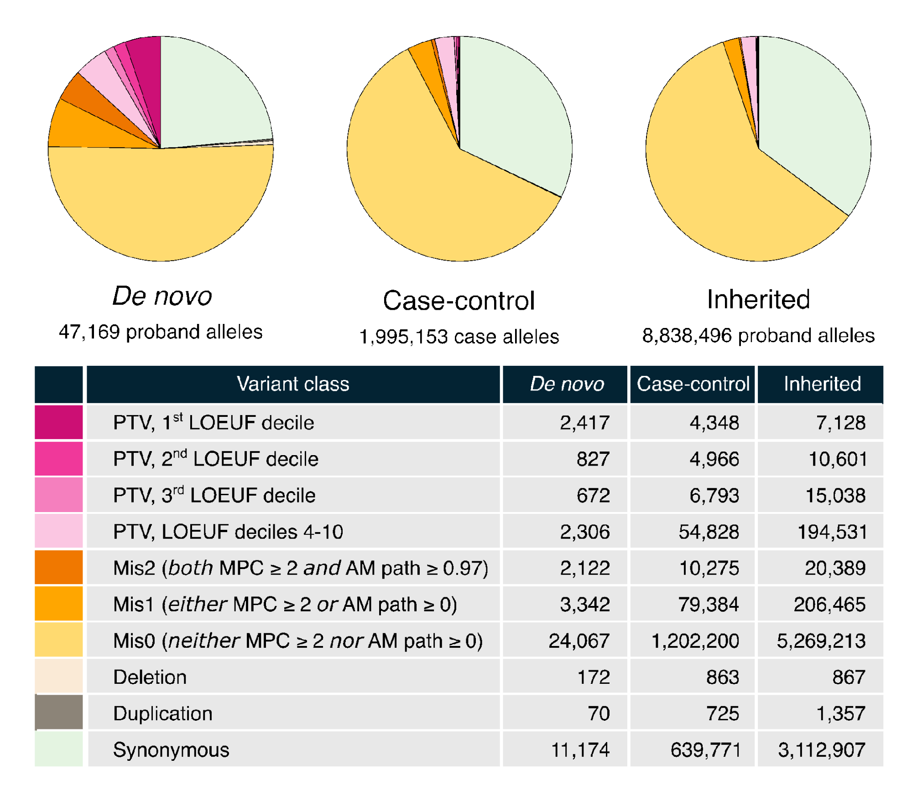
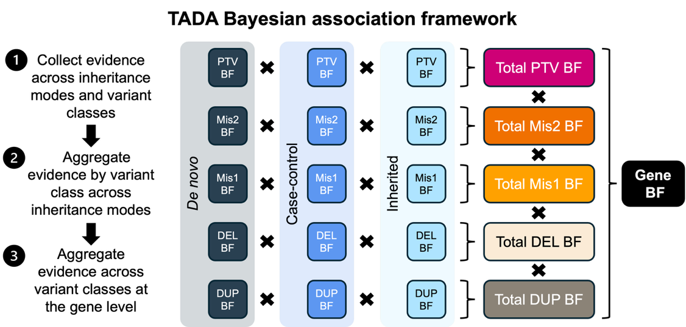

## The Autism Sequencing Consortium

Founded in 2010, the [Autism Sequencing Consortium (ASC)](https://pubmed.ncbi.nlm.nih.gov/23259942/) is a partnership of research groups and clinical sites that studies genetic risk factors for autism. ASC clinical sites recruit individuals with an autism diagnosis, as well as their parents, for participation. These data are aggregated with other large-scale contemporaneous sequencing datasets to empower the discovery of genes in which damaging variants are associated with increased autism risk.

Over the years, analyses spearheaded by the ASC have identified a growing number of autism-associated genes (Fig. 1).

<figure style="max-width: 620px;">

<figcaption>

**Figure 1 | Evolution of the ASC gene discovery efforts.**

(a) Number of autism-associated genes (y-axis) identified by the ASC as a function of sample size (y-axis) at various false discovery rates (FDR). Years refer to ASC publications: De Rubeis et al., 2014; Satterstrom et al., 2020; Fu et al., 2022; Satterstrom et al., 2026. (b) Replication of autism-associated genes identified by consecutive ASC studies at FDR < 0.001, which approximates exome-wide significance. Years correspond to studies as in (a).

</figcaption>

</figure>

## Gene discovery efforts

Data in this Browser originate from the ASC's most recent exome sequencing aggregation efforts ([Satterstrom et al., 2026](https://www.medrxiv.org/content/10.64898/2026.08.24.26360398v1.article-info)). We aggregated exome sequence data from research, clinical, and population cohorts, including both family-based and case-control data (Fig. 2). In the family-based data (i.e., trios with parental sequences), we can distinguish between _de novo_ mutations and inherited variants; we refer to cases and controls as "probands" and "siblings," respectively. We analyze variants from 62,429 individuals with recorded autism (38,680 probands and 23,749 cases) and 33,316 individuals without recorded autism (9,567 siblings and 23,749 controls).

Family-based data are drawn from four major cohorts: the Autism Sequencing Consortium (ASC), the [Simons Simplex Collection](https://www.sfari.org/resource/simons-simplex-collection/) (SSC), the [Simons Powering Autism Research](https://sparkforautism.org/) (SPARK) study, and the GeneDx clinical testing laboratory (CTL); we also include published _de novo_ variants from individuals with autism from the [Deciphering Developmental Disorders](https://www.ddduk.org/) (DDD) study. Case-control data are drawn from three cohorts: a [Lundbeck Foundation Initiative for Integrative Psychiatric Research](https://ipsych.dk/en/about-ipsych) (iPSYCH) cohort, the Population-based Autism Genetics and Environment Study (PAGES), and non-family-based cases from SPARK matched to [UK Biobank](https://www.ukbiobank.ac.uk/) control samples (Fig. 2).

<figure style="max-width: 535px;">

<figcaption>

**Figure 2 | Cohort composition.**

Sample count by cohort of origin. For each cohort, the number of affected probands and unaffected siblings (family-based design) and the number of cases and unaffected controls (case-control design) are reported, as well as whether SNVs/indels and CNVs are available and the ascertainment strategy of the cohort. Total counts are indicated in the pedigree schemes.

</figcaption>

</figure>

We generated and harmonized short sequence variant (i.e., single nucleotide variants [SNVs] and small insertions/deletions [indels]) and copy-number variant (CNV; i.e., deletions and duplications) callsets (Fig. 3). For family-based data, variants were divided by inheritance mode (_de novo_ and rare inherited variants), while for case-control data all rare variants are analyzed. Rare variants were defined by an allele frequency ≤ 0.1%. SNVs/indels included in this analysis are those annotated as protein-truncating variants (PTVs), missense variants, or synonymous variants (Fig. 3); missense variants were further categorized using Missense Deleteriousness Prediction by Constraint (MPC) and AlphaMissense estimated pathogenicity (AM path) scores, with "Mis2" variants satisfying MPC ≥ 2 and AM path ≥ 0.97, "Mis1" variants satisfying one of these criteria, and "Mis0" variants satisfying neither. Included CNVs are restricted to those that span ≥ 3 exons and affect 1-3 constrained genes (Fig. 3).

<figure style="max-width: 438px;">

<figcaption>

**Figure 3 | Variant callset description.**

Relative abundance of variant classes in probands (_de novo_ and inherited data) or cases (case-control data). SNVs/indels are classified as PTVs (stratified by gnomAD v2.1.1 LOEUF constraint decile) or missense variants, stratified into Mis2, Mis1, and Mis0 based on their MPC and AM path scores.

</figcaption>

</figure>

To identify genes in which rare damaging variants associate with autism risk, we leveraged the Transmission And De Novo Association (TADA) Bayesian framework that was developed by the ASC to empower gene discovery through integration of evidence from different data sources ([He et al., 2013](https://pubmed.ncbi.nlm.nih.gov/23966865/)). Specifically, TADA allows us to jointly model _de novo_, inherited, and case-control data across classes of variation for which we see enrichment in autism cases compared to controls (i.e., PTVs, Mis2 variants, Mis1 variants, deletions, and duplications). For each gene, TADA calculates a Bayes Factor (BF) for each combination of inheritance mode and variant class; BFs can then be multiplied to obtain a single overall BF that reflects the total association evidence for that gene (Fig. 4). BFs can be transformed into an estimated false discovery rate (FDR). Applying TADA to autosomal variants from our aggregated 62,429 affected individuals and respective family-based and population controls, we identify 253 genes where damaging mutations are associated with an autism diagnosis at FDR < 0.001, which approximates exome-wide significance. A total of 696 genes reach FDR < 0.05.

<figure style="max-width: 491px;">

<figcaption>

**Figure 4 | Transmission and _de novo_ Association Bayesian association framework.**

The TADA framework collects gene-level evidence as Bayes factors (BFs) for association with autism across variant classes and modes of inheritance. SNVs/indels are classified as PTVs or missense variants, with the latter split by predicted pathogenicity into Mis2 and Mis1. Qualifying coding CNVs are classified as deletions (DEL) or duplications (DUP), with BF evidence apportioned by gene-level LOEUF constraint for multigenic CNVs.

</figcaption>

</figure>

For more details on the data aggregation and analysis efforts, please refer to the ASC's latest flagship publication ([Satterstrom et al., 2026](https://www.medrxiv.org/content/10.64898/2026.08.24.26360398v1.article-info)).

## Acknowledgment

We are grateful to individuals who consented to have their sequencing data used in research, as this study would not be possible without them.

Funding supporting this research, new data collections, sequencing, and analysis efforts was derived from the Simons Foundation Autism Research Initiative (SFARI), GeneDx LLC, the National Institutes of Health (NIH), the Seaver Foundation, the SWT Foundation, the Lundbeck Foundation, the Novo Nordisk Foundation, the U.S. Department of Defense, the Swiss National Science Foundation, Health Data Research UK Molecules to Health Records Driver Programme, the São Paulo Research Foundation, the Japan Agency for Medical Research and Development, and the Japan Society for the Promotion of Science.

## ASC Flagship publications

Satterstrom, F. K., Auwerx, C., Fu, J. M., _et al._ Rare variation illuminates the distinct and pleiotropic genetic architecture of autism across neuropsychiatric traits. _medRxiv_ (2026). DOI: [https://www.medrxiv.org/content/10.64898/2026.08.24.26360398v1](https://doi.org/10.64898/2026.08.24.26360398).

Fu, J. M., Satterstrom, F. K., Peng, M., Brand, H., _et al._ Rare coding variation provides insight into the genetic architecture and phenotypic context of autism. _Nat. Genet._ 54, 1320–1331 (2022). PMID: [35982160](https://pubmed.ncbi.nlm.nih.gov/35982160/).

Satterstrom, F. K., Kosmicki, J. A., Wang, J., _et al._ Large-scale exome sequencing study implicates both developmental and functional changes in the neurobiology of autism. _Cell_ 180, 568–584.e23 (2020). PMID: [31981491](https://pubmed.ncbi.nlm.nih.gov/31981491/).

De Rubeis, S. _et al._ Synaptic, transcriptional and chromatin genes disrupted in autism. _Nature_ 515, 209–215 (2014). PMID: [25363760](https://pubmed.ncbi.nlm.nih.gov/25363760/).

Buxbaum, J. D., _et al._, 2012. The autism sequencing consortium: large-scale, high-throughput sequencing in autism spectrum disorders. _Neuron_ 76, 1052–1056 (2012). PMID: [23259942](https://pubmed.ncbi.nlm.nih.gov/23259942/).

## Contact

ASC principal investigators include Dr. [Joseph Buxbaum](mailto:joseph.buxbaum@mssm.edu), Dr. [Mark Daly](mailto:mjdaly@broadinstitute.org), Dr. [Bernie Devlin](mailto:devlinbj@upmc.edu), Dr. [Kathryn Roeder](mailto:kathryn.roeder@gmail.com), Dr. [Stephan Sanders](mailto:stephan.sanders@paediatrics.ox.ac.uk), and Dr. [Michael Talkowski](mailto:talkowsk@broadinstitute.org). For questions relating to sample recruitment and collection, contact Dr. Joseph Buxbaum; for questions regarding data aggregation and gene discovery, contact Dr. Michael Talkowski and Dr. Mark Daly. For questions about gene discovery and its implications, please contact any of the PIs.
