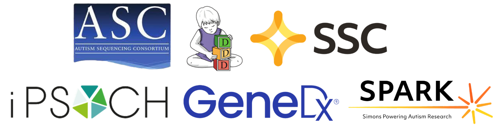
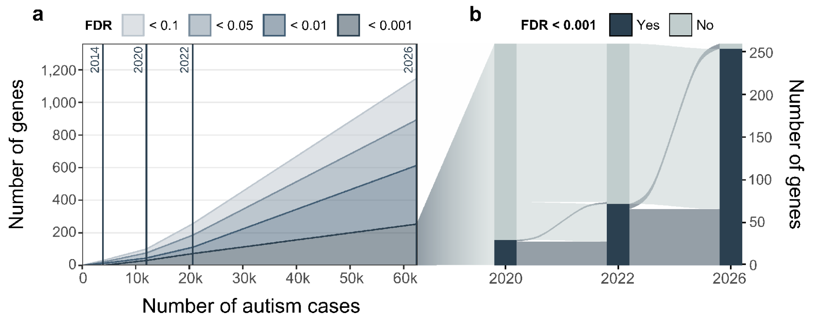
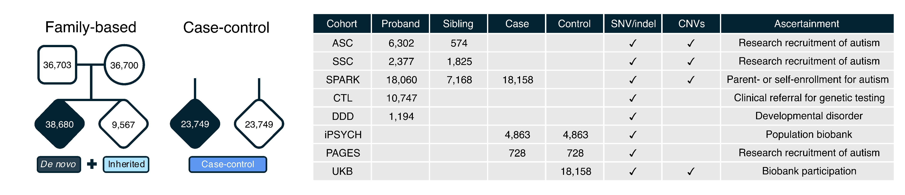
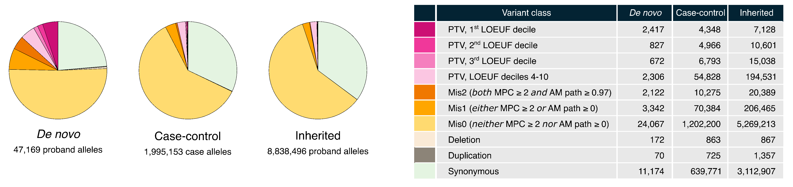
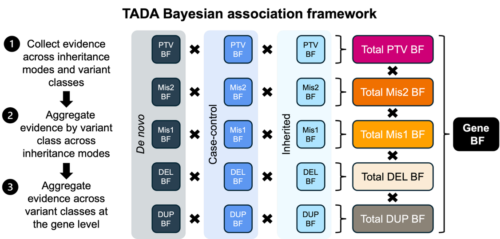

## About this Browser

The Autism Genomics Browser (AGB) displays the results of our cross-consortia autism genomics data aggregation and gene discovery efforts. The most recent data freeze ([Satterstrom, Auwerx, Fu et al., 2026](https://www.medrxiv.org/content/10.64898/2026.08.24.26360398v1), _medRxiv_) encompasses data from 62,429 individuals with recorded autism (38,680 probands and 23,749 cases) and 33,316 individuals without recorded autism (9,567 siblings and 23,749 controls). The data were aggregated and analyzed as part of an initiative that includes investigators and samples from the [Autism Sequencing Consortium (ASC)](https://pubmed.ncbi.nlm.nih.gov/23259942/), the [Simons Foundation Autism Research Initiative (SFARI)](https://www.sfari.org/), our clinical diagnostic laboratory partner [GeneDx](https://www.genedx.com/), the Danish [iPSYCH](https://ipsych.dk/en/about-ipsych) project, and other collaborators dedicated to advancing our understanding of the genetic basis of autism.

## About these Consortia

### ASC

The [Autism Sequencing Consortium (ASC)](https://pubmed.ncbi.nlm.nih.gov/23259942/) is an international collaboration of research groups and clinical sites dedicated to the collection and analysis of sequencing data from autistic individuals. Founded in 2010, the ASC aggregates data from research, clinical, and population cohorts to empower the discovery of genes in which damaging variants are associated with autism. References to the ASC should note the 2012 Flagship paper ([Buxbaum et al., 2012](https://pubmed.ncbi.nlm.nih.gov/23259942/)).

### SPARK

[SPARK](https://sparkforautism.org/) (Simons Foundation Powering Autism Research) is an autism research study and a growing community of individuals with autism, their families, and researchers. SPARK’s mission is to improve the lives of people with autism by identifying the causes of autism and supporting research that informs more effective diagnoses, therapies, treatments, services, and supports. SPARK is funded by [SFARI](https://www.sfari.org/). The program includes collaboration with 31 university-affiliated research clinics in 26 states across the U.S. In addition, numerous national and local autism community organizations across the U.S. partner with SPARK to help recruit participants and spread the word about this landmark study. Since SPARK launched in 2016, it has become one of the largest and most widely used autism datasets, including over 157,771 people with autism and 222,906 of their family members.

### Simons Simplex Collection

The [Simons Simplex Collection](https://www.sfari.org/resource/simons-simplex-collection/) (SSC) is a permanent repository of genetic samples from 2,600 simplex families (i.e., one child affected with autism, and unaffected parents and siblings) and corresponding medical and phenotype information. The SSC was operated by [SFARI](https://www.sfari.org/) in collaboration with [12 university-affiliated research clinics](https://www.sfari.org/resource/simons-simplex-collection-sites/). Active enrollment of participants ended in 2011, although 1,500 families are now enrolled in an online, contactable platform called the SSC registry. In 2015, SFARI recontacted all of these families to request updated medical and educational information for all family members. A central database containing anonymized information from all study participants is available to qualified researchers through [SFARI Base](https://base.sfari.org/).

### GeneDx

[GeneDx](https://www.genedx.com/), LLC is a genomics and biotechnology company that provides genetic testing, clinical interpretation, and related information to support diagnosis, treatment decisions, and research for rare and inherited conditions. Through our partnership with GeneDx, we have accessed anonymized genetic and phenotypic data from individuals with a recorded autism diagnosis who have been referred for clinical genetic testing.

### DDD

The [DDD](https://www.ddduk.org/) (Deciphering Developmental Disorders) study aims to improve understanding of the genetic bases of developmental disorders. The study collaborates with 24 Regional Genetics Services throughout the UK and Republic of Ireland and scientists at the [Wellcome Sanger Institute](https://www.sanger.ac.uk/), with support from the NHS National Institute for Health Research. While enrolment for DDD is now finished, the study has collected genetic data from over 30,000 children with undiagnosed developmental disorders and their families.

### iPSYCH

[iPSYCH](https://ipsych.dk/en/about-ipsych) (The Lundbeck Foundation Initiative for Integrative Psychiatric Research) is a Danish national project established in 2012. This cohort was established to better study hereditary and environmental causes of mental disorders, with the goal of improving treatment and prevention of autism, attention-deficit/hyperactivity disorder, schizophrenia, bipolar disorder, and depression.

### PAGES

PAGES (Population-based Autism Genetics and Environment Study) is a study launched by the Karolinska Institutet in 2010 (originally called SAGA) to disentangle genetic and environmental factors contributing to autism. People living in Sweden who have been diagnosed with autism at some point in their lives are identified via the National Patient Register and contacted and offered to participate.

<figure style="max-width: 70%;">

</figure>

## Autosomal gene discovery efforts

Over the past decade, our teams have led analyses to identify a growing number of genes in which mutations increase the chances of an autism diagnosis (**Fig. 1**).

<figure style="max-width: 75%;">

<figcaption>

**Figure 1 | Trajectory of autism gene discovery efforts.**

**(a)** Number of autism-associated genes (y-axis) identified by our teams as a function of sample size (y-axis) at various false discovery rates (FDR). Years refer to ASC publications: De Rubeis et al., 2014; Satterstrom, Kosmicki, Wang et al., 2020; Fu, Satterstrom, Peng, Brand, et al., 2022; Satterstrom, Auwerx, Fu, et al., 2026. **(b)** Replication of autism-associated genes identified by consecutive ASC studies at FDR < 0.001, which approximates exome-wide significance. Years correspond to studies as in (a).

</figcaption>

</figure>

Data in the Autism Genomics Browser originates from our team’s latest exome sequencing aggregation efforts ([Satterstrom, Auwerx, Fu, et al., 2026](https://www.medrxiv.org/content/10.64898/2026.08.24.26360398v1.article-info)). We aggregated exome sequence data from research, clinical, and population cohorts, including both family-based and case-control data (**Fig. 2**). In the family-based data (i.e., trios with parental sequences), where we can distinguish between _de novo_ mutations and inherited variants, we refer to cases and controls as “probands” and “siblings,” respectively. We analyze variants from 62,429 individuals with recorded autism (38,680 probands and 23,749 cases) and 33,316 individuals without recorded autism (9,567 siblings and 23,749 controls).

Family-based data are drawn from four major cohorts: the ASC, the SSC, the SPARK study, and the GeneDx clinical testing laboratory (CTL); we also include published _de novo_ variants from individuals with autism from the [Deciphering Developmental Disorders](https://www.ddduk.org/) (DDD) study. Case-control data are drawn from three cohorts: iPSYCH, PAGES, and non-family-based cases from SPARK matched to [UK Biobank](https://www.ukbiobank.ac.uk/) control samples (**Fig. 2**).

<figure style="max-width: 90%;">

<figcaption>

**Figure 2 | Cohort composition.**

Sample count by cohort of origin. For each cohort, the number of affected probands and unaffected siblings (family-based design) and the number of cases and unaffected controls (case-control design) are reported, as well as whether SNVs/indels and CNVs are available and the ascertainment strategy of the cohort. Total counts for SNV/indel analyses are indicated in the pedigree schemes. Note that our analysis includes _de novo_ but not inherited variants from the DDD cohort. See the supplementary information of [Satterstrom, Auwerx, Fu, et al., 2026](https://www.medrxiv.org/content/10.64898/2026.08.24.26360398v1.article-info) for additional details such as sex ratio. SNVs: single nucleotide variants; indels: short insertions or deletions; CNVs: copy-number variants.

</figcaption>

</figure>

We generated and harmonized callsets of short sequence variants (i.e., single nucleotide variants [SNVs] and small insertions/deletions [indels]) and copy-number variants (CNV; i.e., deletions and duplications) (**Fig. 2b**). For family-based data, variants are divided by inheritance mode (_de novo_ and rare inherited variants), while for case-control data all rare variants are analyzed. Rare variants are defined by an allele frequency ≤ 0.1%. SNVs/indels included in this analysis are those annotated as protein-truncating variants (PTVs), missense variants, or synonymous variants (**Fig. 3**); missense variants are further categorized using Missense Deleteriousness Prediction by Constraint (MPC) and AlphaMissense estimated pathogenicity (AM path) scores, with “Mis2” variants satisfying MPC ≥ 2 and AM path ≥ 0.97, “Mis1” variants satisfying one of these criteria, and “Mis0” variants satisfying neither. Included CNVs are restricted to those that span ≥ 3 exons and affect 1-3 constrained genes (**Fig. 3**).

<figure style="max-width: 75%;">

<figcaption>

**Figure 3 | Autosomal variant callset description.**

Relative abundance of variant classes in probands (_de novo_ and inherited data) or cases (case-control data). SNVs/indels are classified as PTVs (stratified by gnomAD v2.1.1 LOEUF constraint decile), missense variants (categorized as Mis2, Mis1, or Mis0 based on their MPC and AM path scores), or synonymous variants. Counts reflect only those variants included in our gene discovery model.

</figcaption>

</figure>

To identify genes in which rare damaging variants are associated with autism risk, we employed the Transmission And _De Novo_ Association (TADA) Bayesian framework to empower gene discovery through integration of evidence from different data sources ([He et al., 2013](https://pubmed.ncbi.nlm.nih.gov/23966865/)). TADA allows us to jointly model _de novo_, inherited, and case-control data across classes of variation for which we see enrichment in autism cases compared to controls (i.e., PTVs, Mis2 variants, Mis1 variants, deletions, and duplications). For each gene, TADA calculates a Bayes Factor (BF) for each combination of inheritance mode and variant class; BFs can then be multiplied to obtain a single overall BF that reflects the total association evidence for that gene (**Fig. 4**). BFs can be transformed into an estimated false discovery rate (FDR). Applying TADA to autosomal variants from our aggregated 62,429 affected individuals and respective family-based and population controls, we identify 253 genes where damaging mutations are associated with an autism diagnosis at FDR < 0.001, which approximates exome-wide significance. A total of 696 genes reach FDR < 0.05.

<figure style="max-width: 75%;">

<figcaption>

**Figure 4 | Transmission and _de novo_ Association Bayesian association framework.**

The TADA framework collects gene-level evidence as Bayes factors (BFs) for association with autism across variant classes and modes of inheritance. SNVs/indels are classified as PTVs or missense variants, with the latter split by predicted pathogenicity into Mis2 and Mis1. Qualifying coding CNVs are classified as deletions (DEL) or duplications (DUP), with BF evidence apportioned by gene-level LOEUF constraint for multigenic CNVs.

</figcaption>

</figure>

For more details on the data aggregation and analysis efforts, please refer to our most recent analysis ([Satterstrom, Auwerx, Fu, et al., 2026](https://www.medrxiv.org/content/10.64898/2026.08.24.26360398v1.article-info)).

## Chromosome X analysis

In addition to autosomal variants, the Browser also displays sex chromosome SNVs/indels (CNVs were not called for sex chromosomes). Genes on sex chromosomes can be searched, and variants in these genes can be browsed in gene-specific variant-level tables. However, summary statistics are not available in the Results table for these genes, as modelling of sex chromosomes in genetic association studies requires special considerations that are not dealt with by the standard TADA framework. For this purpose, we developed quantitative X-linked TADA, which is specifically designed to handle the biology of chromosome X ([Satterstrom et al., 2026](https://www.medrxiv.org/content/10.64898/2026.05.04.26352380v1)). Applied to SNVs from the majority of samples considered here (50,663 individuals with autism), we identify 9 genes on chromosome X associated with autism at FDR < 0.05 ([Satterstrom et al., 2026](https://www.medrxiv.org/content/10.64898/2026.05.04.26352380v1)).

## Acknowledgment

We are grateful to individuals who consented to have their sequencing data used in research, as this study would not be possible without them. We are also grateful for the collaboration of our commercial diagnostic laboratory partner, GeneDx LLC.

Funding to support the development of the Autism Genomics Browser (AGB) was provided by the Stanley Center for Psychiatric Research at the Broad Institute of MIT and Harvard, the National Institute of Mental Health (NIMH), the National Human Genome Research Institute (NHGRI), and the Swiss National Science Foundation. Analyses of the data in the AGB were supported by the Simons Foundation Autism Research Initiative (SFARI), the National Institutes of Health (NIMH, NHGRI), the Seaver Foundation, the SWT Foundation, the Lundbeck Foundation, the Novo Nordisk Foundation, the Swiss National Science Foundation, the Health Data Research UK QQ2 Molecules to Health Records Driver Programme, and the São Paulo Research Foundation.

## Publications

Generation of data displayed in the AGB is described here:

Satterstrom, F. K., Auwerx, C., Fu, J. M., _et al._ Rare variation illuminates the distinct and pleiotropic genetic architecture of autism across neuropsychiatric traits. _medRxiv_ (2026). DOI: [https://doi.org/10.64898/2026.08.24.26360398](https://doi.org/10.64898/2026.08.24.26360398).

## Contact

For questions about data aggregation, analyses, and gene discovery in the AGB, please contact [Dr. Michael Talkowski](mailto:talkowsk@broadinstitute.org) and [Dr. Mark Daly](mailto:mjdaly@broadinstitute.org). For questions about analyses in Satterstrom et al., 2026, please contact [Dr. Kyle Satterstrom](mailto:satterst@broadinstitute.org) and [Dr. Chiara Auwerx](mailto:cauwerx@broadinstitute.org).

For questions about the ASC data, publications, or sample recruitment, please contact [Dr. Joseph Buxbaum](mailto:joseph.buxbaum@mssm.edu). For questions about ASC analyses and gene discovery methods, contact any of the ASC PIs: [Dr. Joseph Buxbaum](mailto:joseph.buxbaum@mssm.edu), [Dr. Mark Daly](mailto:mjdaly@broadinstitute.org), [Dr. Bernie Devlin](mailto:devlinbj@upmc.edu), [Dr. Kathryn Roeder](mailto:kathryn.roeder@gmail.com), [Dr. Stephan Sanders](mailto:stephan.sanders@paediatrics.ox.ac.uk), and [Dr. Michael Talkowski](mailto:talkowsk@broadinstitute.org).
